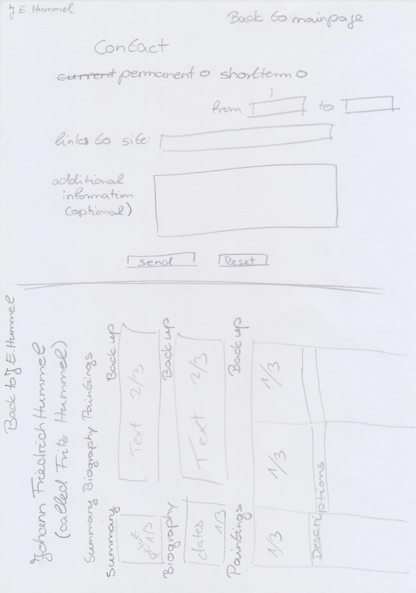

# Johann Erdmann Hummel

Text über die Seite

View the live project here: https://renaschott.github.io/Project1-J.E.Hummel/

[Is my site responsive?](assets/readme-images/am-I-responsive.png)

## Features

- **Navigation**

Text
screenshot

- **Header**

Text
screenshot

- **Footer**

Text
screenshot

- **Index page**

Text
screenshot

- **Biography page**

Text
screenshot

- **Paintings page**

Text
**screenshot**

- **Exhibition page**

Text
screenshot

- **Contactform page**

Text
screenshot

## Future Features

In the future more paintings, more details about former exhibitions and more content will be added to the biography page.
Furthermore a site about his son Fritz Hummel will be built and a link integrated into the biography page. The look of the Fritz Hummel page
can be seen on the fifth scretch of the wireframes for mobile size and in the image below.

## Testing

- nnnn

### Bugs
#### Solved Bugs

### Validator testing

- **HTML**
  - jhsdflqa
  
- **CSS**
  - fioewfh

- **Accessibility**
  - jeojdf

### Unfixed bugs

No unfixed bugs

## Deployment

The deployment was done using <https://github.com/>
- For this the following steps were used:
  - Open the appropriate git hub repository
  - Click on the Settings tab in the navigation
  - Open Pages in the dropdown menu
  - Do the following steps in the Build and deployment section
    - Select "deploy from branch" in source
    - Select "main" in select branch
    - Select "/(root)" in select folder
    - Finally push the save button
  - From now onwards the deployed site can be visited using the link provided on top of the page

The link to the live page can be found here: [Johann Erdmann Hummel] (<https://renaschott.github.io/Project1-J.E.Hummel/>)

## Credits

### Content
The content of this project was inspired by the Love Running project, thw wesite <https://www.w3schools.com/> as well as the course content in general. On the other hand some specific inspiration were taken from <https://www.youtube.com/watch?v=Jj42_s3KnuM> for the 404 page and from https://codepen.io/ngochuynh/pen/yKrvVZ for the burger icon in the navbar in the heading.

### Media
The hero image from the landing page were taken from wikipedia (<https://de.wikipedia.org/wiki/Johann_Erdmann_Hummel>), while all the other images are copied out of the books from Georg Hummel ("Der Maler Erdmann Hummel. Leben und Werk." published in Leipzig, by VEB E.A. Seemann 1954) and Birgit Verwiebe ("Magische Spiegelungen Johann Erdmann Hummel" Nationalgalerie der Staatlichen Museen zu Berlin). The favicon was drawn im gimp.
                            
