# Johann Erdmann Hummel

This website is about an ancestor of mine. Johann Erdmann Hummel was a painter in the hist. Biedermeier time in Berlin. As a professor, he had influence
on future generations in art and architecture with his talents in drawing different perspectives. 

Users of this website will find different informations about J.E. Hummel as a short summary together with an appealing painting
of his on the landing page. More informations are on the respective sites (Biography, Paintings and Exhibitions). Very one is encouraged to participate
in spreading the word of new or old exhibitions and publications by using the respective contact form.
In general, this site was written for users interested in Biedermeier Art.

View the live project here: https://renaschott.github.io/Project1-J.E.Hummel/

## Features

- **Header and Navigation**

  - The navigation is in the top right corner of the page. 
    - It includes anchor links to the landing, the biography, the paintings and the exhibition page.
    - The color used fits well and is in the same time decent.
    - The menu list item corresponding to the actual page is underlined and written in a slightly lighter color.
  - The header includes in the middle the name of the person (J.E. Hummel) the site is about.
  - Lastly, a black and white self portrait of Johann Erdmann Hummel is used as a logo in the top left corner.
  - The background color is beige.
  - The header section in total explaines the user what they can expect on the pages.
  
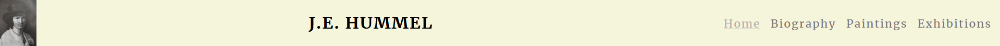

- **Footer**

    - The footers start with a call to the users to encourage them to find more informations on other sites.
    - Therefore icons for clickable icons for facebook, Twitter and Instagram which opens in a new tab were integrated.
    - The footer has the same background color as the header.
    - The header section tries to give options for the users to stay informned about Johann Erdmann Hummel. 

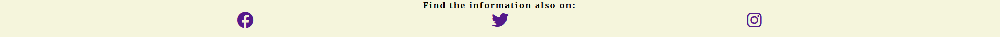

- **Index page**
    
    - Therefore a beautifully drawn landscape with a castle in the background and people walking around naturally is used as a background image.
    - And few dates are listed together with the nickname of the painter to show the user his specialty.
    - All in all the landing page wants to give an appealing and interesting summary and wants to encourage the user to explore the website.
  
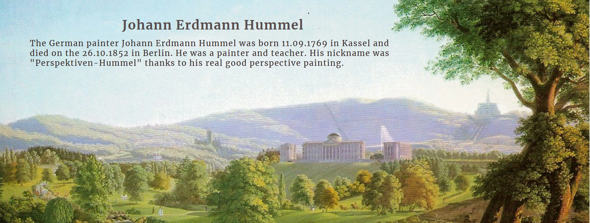

- **Biography page**

    - Few important dates and facts were listed.
    - The background of the biography page is a self portrait of the young Johann Erdmann Hummel.
    - To make sure the text is readable, the div for the text was a background color assigned.
    - By listing up some important dates and the corresponding facts as well as showing this, the user be able to connect with him and should get a feeling of his life.
  
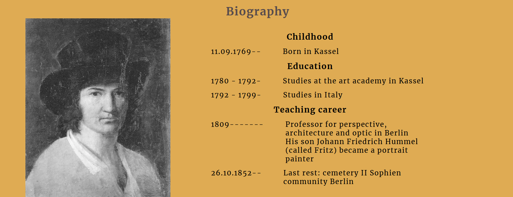

- **Paintings page**

    - The paintings sections displays a few of his beautiful painting and drawings.
    - The names and dates of the paintings and drawing are listed in the corresponding box right underneath the image.
    - The page is designed scrollable.
    - The paintings page does not want to distract the user with images packed in a row. That is why this page in the responsive design does not show images next to each other.
    - The brown background color matches the beige background color of the footer and header.
    - By viewing the paintings page, the user should get interested in more in formations like exhibitions and publications.
  
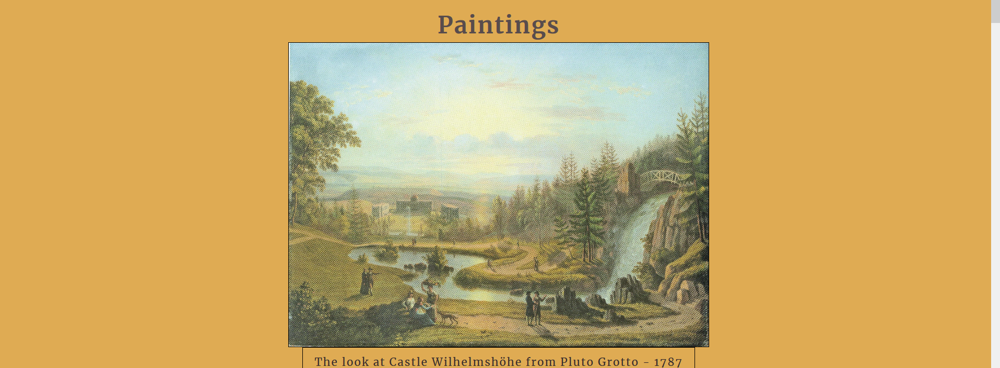

- **Exhibition page**

    - As the final big page, the exhibition page lists the permanent exhibition with the museum name, address and an image of the location on Google Maps.
    - The short term exhibition section gives the user information of actual or past exhibitions.
    - The publication section shows the user where to find additional informations.
    - The last section is a call to contribute to this page by clicking on the links to the form page.
    - This page is also scrollable designed.
    - The same background color as on the paintings section is used.
    - The user should feel encouraged to go out and look at the paintings in person, as well as to keep an eye on new information and inform me.

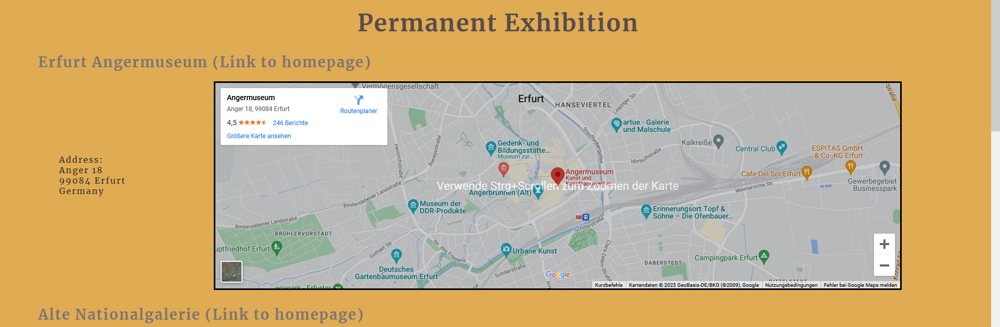

- **Contact form page**

    - In the contact form the user can choose whether the user found a new publication or exhibition.
    - More informations can be filled in as well as there is a text field where the user can decide on the user's own what to write.
    - Throughout the contact form the user is guided on which question to answer next when the user can skip one or some.
    - The user is allowed to skip some question on his own.
    - Filling in whether the user has information on an exhibition or and publication and the URL link to the respective site is mandatory. 
    - Getting in touch with the user should make the user interested in coming back.

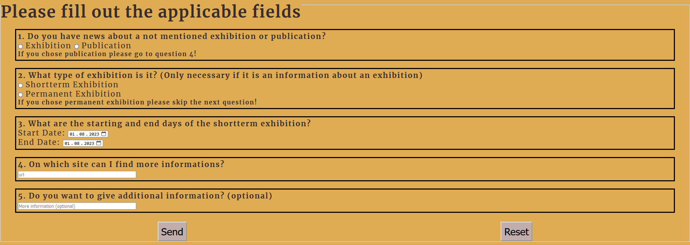

## Features left to implement

In the future more paintings, more details about former exhibitions and more content will be added to the biography page.
Furthermore, a site about his son Fritz Hummel will be built ,and a link integrated into the biography page. The look of the Fritz Hummel page
can be seen on the fifth drawing of the wireframes for mobile size and in the image below.

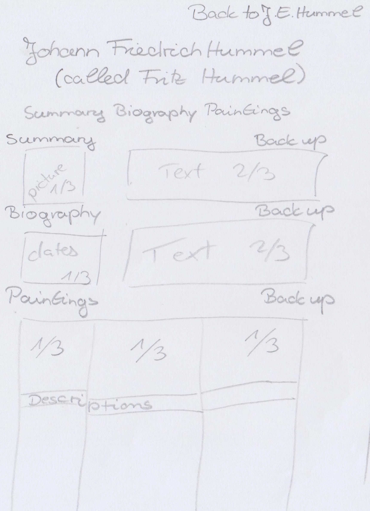

## UX

### Site goals
This site wants to show the users the beautiful paintings of Johann Erdmann Hummel as well as some facts about the painter.

### User stories

#### As a visitor

- I want to find more information on Johann Erdmann Hummel.
- I want to learn something about his life.
- I want to see some of his paintings.
- I want to know where I can find more informations about him (publications).
- I want to know where I can go to see his paintings.
- I want to access the information easily.
- For that, I want a well-ordered menu.
- I want to be able to share some missing information with the site owner.

#### As the administrator

- I want to get informed by users of the site of missing exhibitions and publications.
- I want to be able to easily add new information on the page.
- I want to be able to edit the existing information. 

### Wireframes

Here are the drawings of the wireframes:

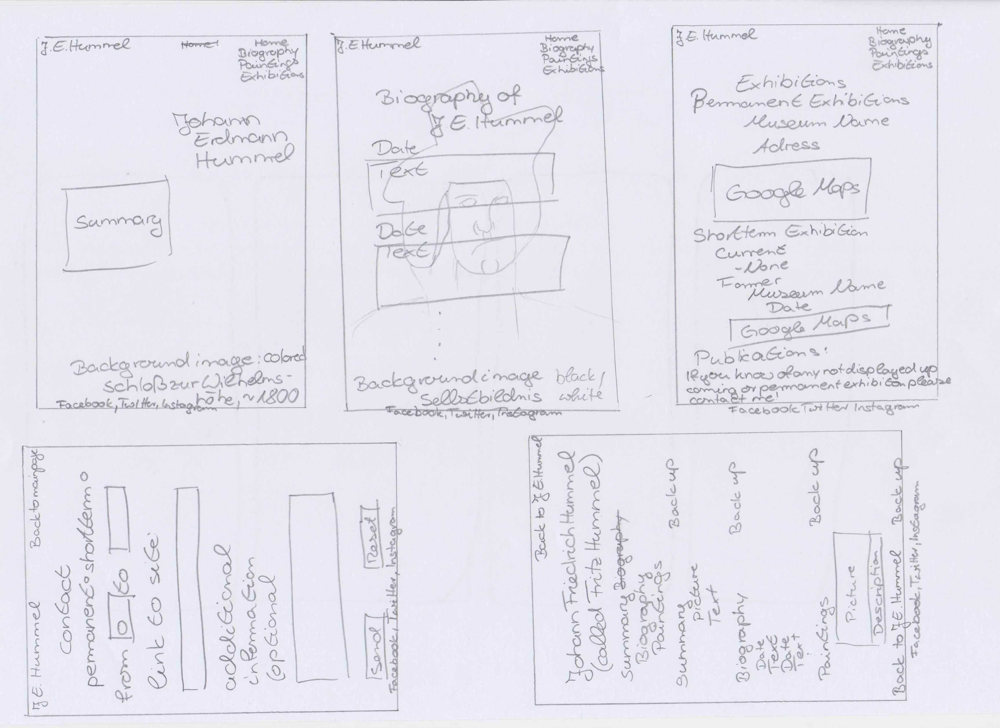
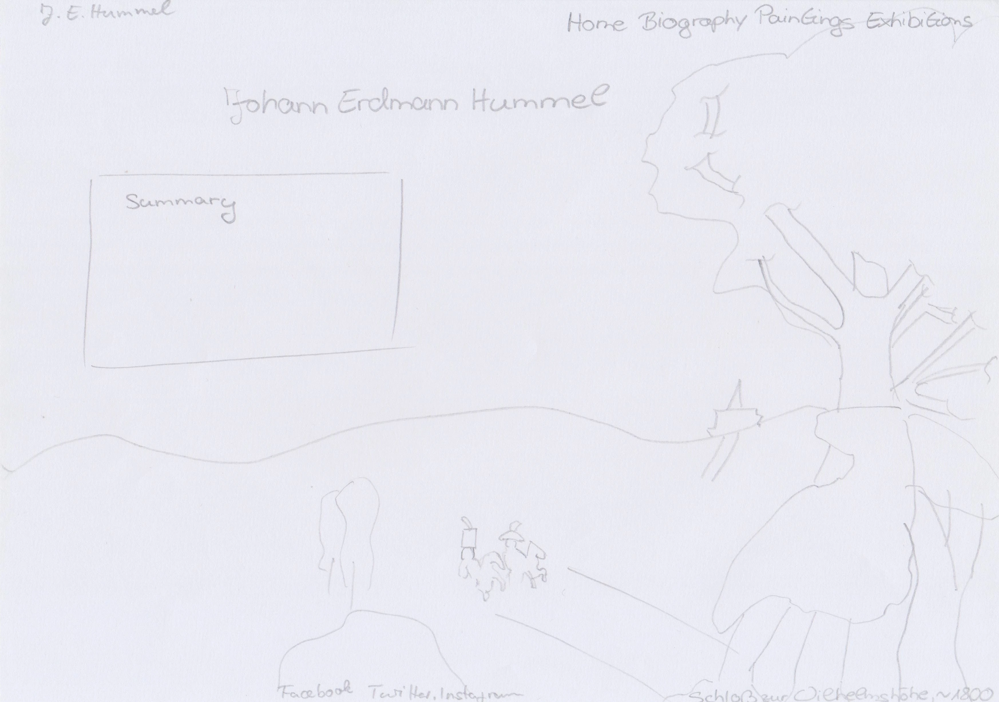
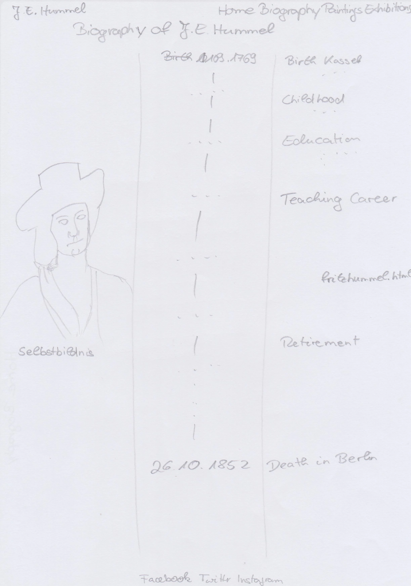
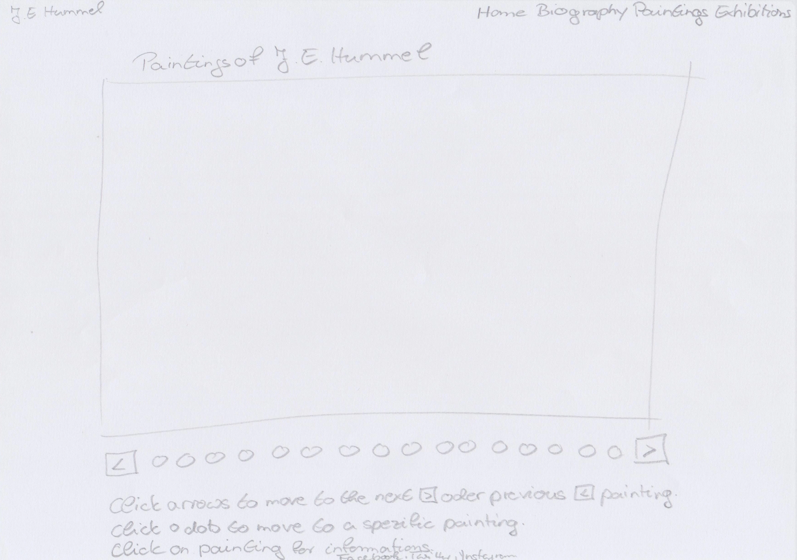
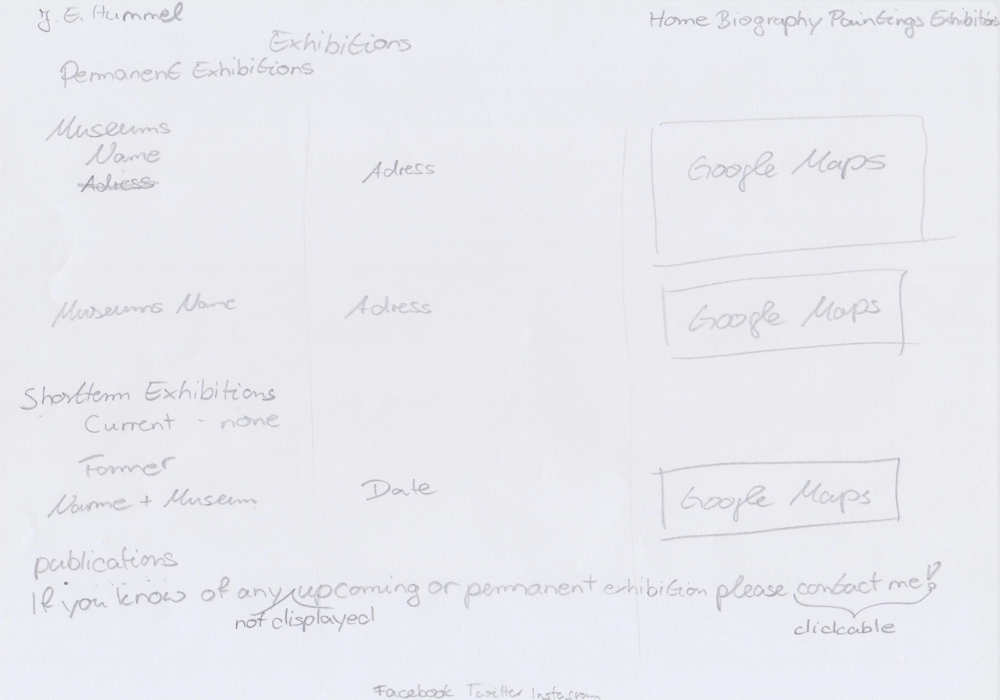
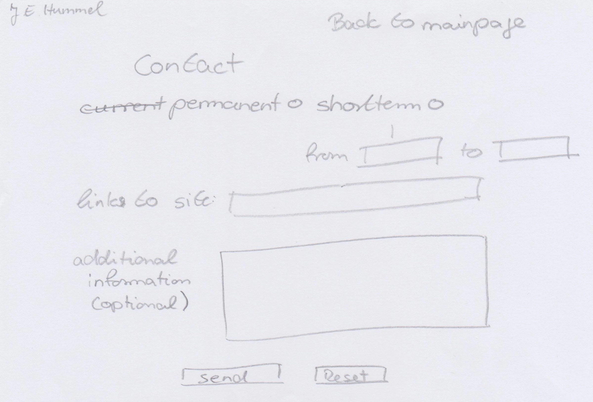

## Used Technologies

### Languages Used

- HTML
- CSS

### Framework, Libraries and Programs

- no frameworks and libraries were used
- GIMP 
    - was used to create the favicon and to edit the images
- Google fonts
    - was used for integrating fonts
- GitHub
    - was used to store and deploy the project site
- Codeanywhere
    - was used to write the code and commit it to GitHub
- Fontawesome
    - was used for the social media icons
- Am I responsive
    - was used to check the responsiveness of the website
- DevTools 
    - were used to inspect the code during the development process and to check the accessibility
- W3C CSS Validator (Jigsaw)
    - was used to validate the css code
- W3C HTML Validator
    - was used to validate the HTML Code
- Languagetool
  - was used to check the spelling and grammar in the README file.
  

## Testing

- The site was tested on different browsers: Chrome and Firefox.
- The DevTools confirmed that the page looks good and is functional on different screen sizes.
- I confirmed that the page is readable.
- The menu is easy to understand.
- I confirmed the function of the form page.

### Validator testing

- **HTML**
  - No errors found when using W3C HTML Validator.
  
- **CSS**
  - During the testing with W3C CSS Validator (Jigsaw) the following error and warnings were found:
  
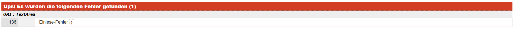

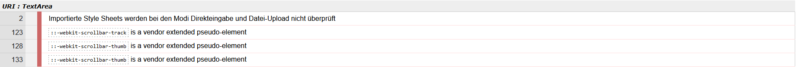

- **Accessibility**
  - The accessibility of the project was confirmed by using lighthouse in the DevTools

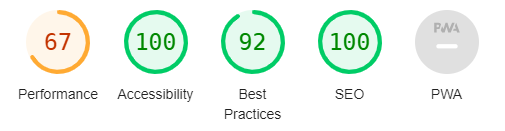

  - In the future the size of the images has to be downgraded in an appropriate way to raise the performance  

### Unfixed bugs

The CSS error described were fixed because of the opening tag in line 112.
The CSS warnings are acceptable.

## Deployment

The deployment was done using <https://github.com/>
- For this, the following steps were used:
  - Open the appropriate GitHub repository
  - Click on the Settings tab in the navigation
  - Open Pages in the dropdown menu
  - Do the following steps in the Build and deployment section
    - Select "deploy from branch" in source
    - Select "main" in select branch
    - Select "/(root)" in select folder
    - Finally push the save button
  - From now onwards the deployed site can be visited using the link provided on top of the page

The link to the live page can be found here: [Johann Erdmann Hummel] (<https://renaschott.github.io/Project1-J.E.Hummel/>)

## Credits

### Content

The content of this project was inspired by the Love Running project, the website <https://www.w3schools.com/> as well as the course content in general. On the other hand, some specific inspiration were taken from <https://www.youtube.com/watch?v=Jj42_s3KnuM> for the 404 page and from https://codepen.io/ngochuynh/pen/yKrvVZ for the burger icon in the navbar in the heading.

### Media

The hero image from the landing page were taken from Wikipedia (<https://de.wikipedia.org/wiki/Johann_Erdmann_Hummel>), while all the other images are copied out of the books from Georg Hummel ("Der Maler Erdmann Hummel. Leben und Werk." published in Leipzig, by VEB E.A. Seemann 1954) and Birgit Verwiebe ("Magische Spiegelungen Johann Erdmann Hummel" Nationalgalerie der Staatlichen Museen zu Berlin). The social media icons were taken from <https://fontawesome.com/>.

## Acknowledgements
- I thank would love to thank the following persons:
  - My mentor for his support
  - The Code Institute tutor support for their fast answers
  - My facilitator for her support
  - The slack community for their fast answers and support

